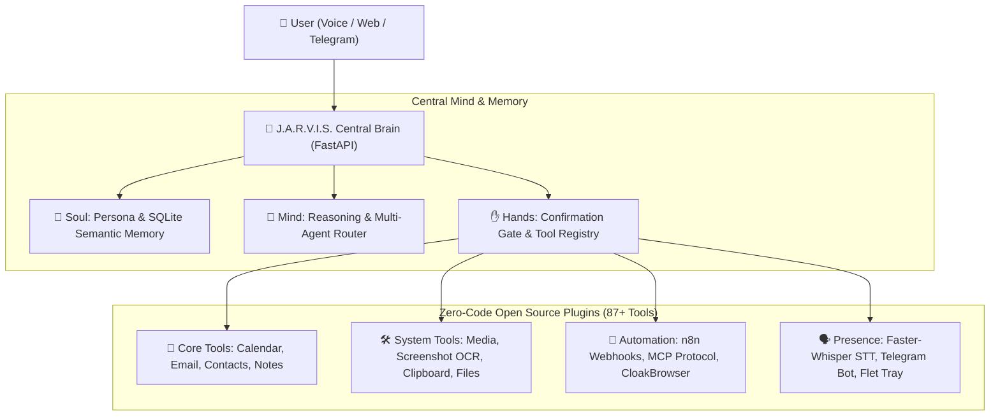

<div align="center">


# 🤖 J.A.R.V.I.S.
### Just A Rather Very Intelligent System
**Autonomous Personal AI Operator · Multi-Agent Swarm · Zero-SaaS Local Engine**

[](#-testing--quality)
[](#-license)
[](#-tech-stack)
[](#-web-interface)
[](#-multi-presence)

</div>

---

## ⚡ Overview

**J.A.R.V.I.S.** is a close personal AI assistant designed to know the user (Soul), execute real-world system and web operations (Hands), and remain accessible across all devices (Presence). 

Built with **Zero-Code OSS Acceleration**, Jarvis integrates over **23 open-source libraries** and exposes **87+ executable tools** without relying on expensive SaaS APIs.

---

## 🌐 System Architecture




---

## ✨ Features & Capabilities

### 📱 Multi-Presence & Voice
- **iPhone & Web Desktop Client**: Modern frosted glassmorphism interface built with Vite, React, and `100dvh` mobile responsiveness.
- **Hands-Free Voice Loop**: Opt-in background wake-word listener (`jarvis`) with system tray controls.
- **Telegram Bot Bridge**: Send text or voice notes to Jarvis directly from your phone.

### ✋ Autonomous Operations (Hands)
- **Stealth Web Scraping & Action**: `CloakBrowser` stealth Playwright engine bypasses anti-bot verification smoothly.
- **System Control**: Native volume & mute control (`pycaw`), clipboard manager (`pyperclip`), and OCR screen capture (`mss` + `pytesseract`).
- **Productivity Ecosystem**: Offline translation (`argostranslate`), PDF report generator (`fpdf2`), RSS news feedparser, Pomodoro focus timer, and habit streak tracker.

### ⚡ Zero-Code Automation
- **n8n Workflow Engine**: Trigger complex multi-app visual workflows (Gmail, Slack, Notion) via a single webhook tool.
- **MCP Server Discovery**: Auto-detects Anthropic Model Context Protocol tools (`npx` Github, Postgres, Brave Search).

---

## 🚀 Quick Start

### 1. Prerequisites
- Python 3.10+
- Node.js 18+ (for Web Client & MCP)

### 2. Backend Setup
```bash
# Clone the repository
git clone https://github.com/dr-week/J.A.R.V.I.S.git
cd J.A.R.V.I.S

# Install dependencies
pip install -r requirements.txt

# Start the Brain server
python -m uvicorn backend.app.main:app --reload --port 8787
```

### 3. Web Client Setup
```bash
cd clients/web
npm install
npm run dev
```

---

## 🧪 Testing & Quality

Run the comprehensive pytest suite covering all 23 plugins and endpoints:

```bash
python -m pytest backend/tests/ -v
```

> **59 passed tests cleanly** across Brain, Soul, Hands, Webhooks, and Plugins.

---

## 📄 License

Distributed under the MIT License. See `LICENSE` for details.
