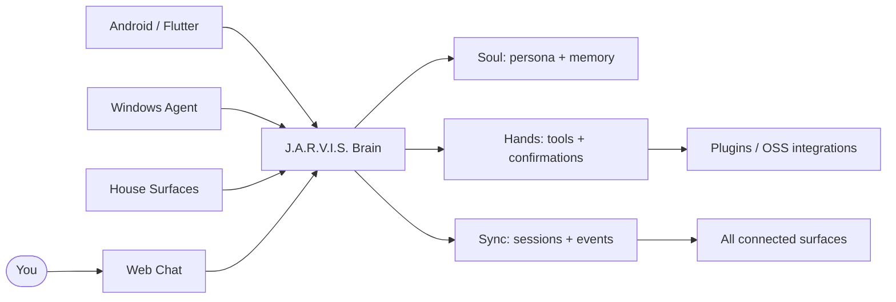

# J.A.R.V.I.S.

<p align="center">
  
</p>

<p align="center">
  <a href="https://github.com/dr-week/J.A.R.V.I.S"></a>
  <a href="https://github.com/dr-week/J.A.R.V.I.S/issues"></a>
  <a href="https://github.com/dr-week/J.A.R.V.I.S/commits/master"></a>
</p>

> J.A.R.V.I.S. is a docs-first personal AI system with a centralized brain, executable tools, synced memory, and multiple physical surfaces.

It is designed to live across your browser, phone, desktop, and house—not as four disconnected assistants, but as one continuous system that knows the user, asks for confirmation when needed, and records what it did.

## The idea

```text
                         ┌──────────────────────────────┐
                         │        J.A.R.V.I.S.           │
                         │  personal context + decisions │
                         └──────────────┬───────────────┘
                                        │
              ┌─────────────────────────┼─────────────────────────┐
              │                         │                         │
        ┌─────▼─────┐             ┌─────▼─────┐             ┌─────▼─────┐
        │  WEB CHAT  │             │  HANDS    │             │  PRESENCE │
        │ daily UI   │             │ tools     │             │ phone/home│
        └─────┬─────┘             └─────┬─────┘             └─────┬─────┘
              └─────────────────────────┼─────────────────────────┘
                                        │
                         ┌──────────────▼───────────────┐
                         │      audit • memory • sync    │
                         └──────────────────────────────┘
```

## What exists today

| Area | Current reality |
| --- | --- |
| Central brain | FastAPI backend with chat, sessions, health, sync, tools, webhooks, and auth flows |
| Daily surface | Web client in clients/web with chat/session experience and PWA-style pieces |
| Presence | Android, Flutter, and Windows client lanes are represented in the monorepo |
| Execution | Tool/plugin boundary exists; Hands work is the active product focus |
| Build system | Board-driven work loop with issue claiming, feedback, docs checks, and acceptance gates |
| Integrations | Repository inventory and small-chunk integration plan live in docs/GITHUB_INTEGRATIONS.md |

These are implementation facts, not a claim that every surface is production-complete. The board is the source of truth for what is done next: [docs/board/NOW.md](docs/board/NOW.md).

## Why this project is different

- **Continuity over chat history:** the same brain can serve web, mobile, desktop, and house surfaces.
- **Actions over theater:** tasks, reminders, device bridges, and plugins are proofs that the assistant can do work.
- **Human control:** sensitive actions can require confirmation and produce an auditable trail.
- **Small, reviewable slices:** every feature is tied to scope, acceptance criteria, tests, and synchronized docs.
- **Open integration strategy:** use proven OSS components where they create leverage instead of rebuilding the ecosystem.

## Architecture at a glance



## Project facts

<p align="center">
  
  
  
  
</p>

The badges above stay live and update from GitHub. The most useful human-readable facts are maintained in the roadmap and board, rather than frozen in this page.

## Run the demo

### Windows

```powershell
Copy-Item .env.example .env
# Add GEMINI_API_KEY to .env when real model responses are needed
.\scripts\demo_up.ps1
```

### macOS / Linux

```bash
cp .env.example .env
# Add GEMINI_API_KEY to .env when real model responses are needed
chmod +x scripts/demo_up.sh && ./scripts/demo_up.sh
```

Architecture-only demos can run with the LLM disabled; the UI and brain wiring remain inspectable.

## Build map

| Stage | Name | Purpose |
| --- | --- | --- |
| D0 | Docs OS | Product scope, contracts, board, and agent workflow |
| D1 | Devloop | Feedback loop for issue selection and completion |
| 0 | Skeleton | Brain plus web, Android, Windows, and Flutter surfaces |
| 1 | Soul | Persona, memory, and synced identity |
| 2 | Hands | Tool runtime, bridges, confirmations, and audit |
| 3 | Life tools | First useful domain plugins |
| 4 | Voice | STT, TTS, tray, and wake word |
| 5 | House | Home hub, room satellites, and smart-home bridges |
| 6 | Expand | SDK for a growing integration ecosystem |

See [docs/ROADMAP.md](docs/ROADMAP.md) for detailed status and [docs/DECISIONS.md](docs/DECISIONS.md) for architecture decisions.

## For contributors and AI agents

1. Read [AGENTS.md](AGENTS.md), [docs/SCOPE.md](docs/SCOPE.md), and [docs/board/NOW.md](docs/board/NOW.md).
2. Select one issue with the devloop and claim it with your owner id.
3. Make the smallest vertical slice that meets its acceptance criteria.
4. Run the relevant tests and documentation checks.
5. Mark the issue done only after the board and mirrored docs are synchronized.

```bash
python scripts/devloop.py status
python scripts/devloop.py next --owner YOUR_ID
python scripts/devloop.py prompt --owner YOUR_ID
python scripts/verify_doc_links.py
```

## Repository map

```text
backend/          central FastAPI brain
clients/web/      primary daily-driver interface
clients/android/  phone presence lane
clients/flutter/  mobile control surface
clients/windows/  desktop / tray presence lane
docs/             product, architecture, board, and integration truth
scripts/          demo, devloop, verification, and research utilities
tools/             executable plugins and integrations
```

## Documentation

- Product direction: [docs/VISION.md](docs/VISION.md), [docs/SCOPE.md](docs/SCOPE.md)
- Current work: [docs/board/NOW.md](docs/board/NOW.md)
- Documentation sync hub: [docs/DOCS_MAP.md](docs/DOCS_MAP.md)
- GitHub integration inventory: [docs/GITHUB_INTEGRATIONS.md](docs/GITHUB_INTEGRATIONS.md)
- Demo script: [docs/DEMO.md](docs/DEMO.md)
- Security: [docs/SECURITY.md](docs/SECURITY.md)

<p align="center"><sub>J.A.R.V.I.S. — one brain, many bodies, real actions.</sub></p>
