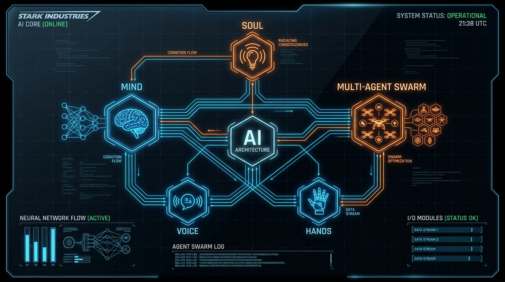
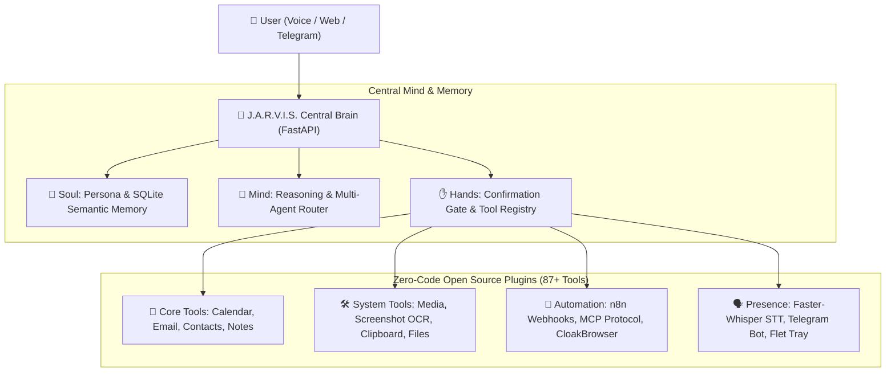
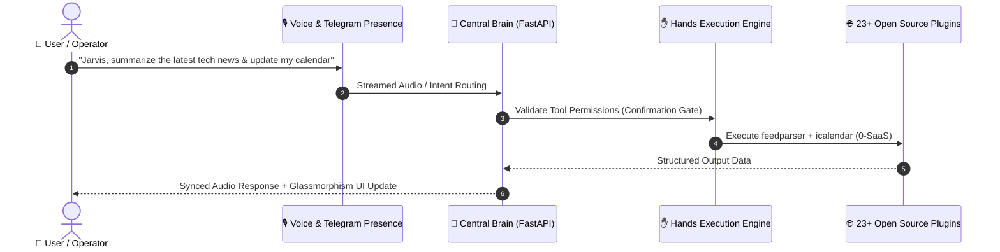

<div align="center">


<div class="banner-anim">
  
</div>

<style>
@keyframes pulse {
  0% { transform: scale(1); opacity:1; }
  50% { transform: scale(1.05); opacity:0.9; }
  100% { transform: scale(1); opacity:1; }
}
.banner-anim img {
  animation: pulse 5s infinite;
}
</style>

# 🤖 J.A.R.V.I.S.
### Just A Rather Very Intelligent System
**Autonomous Personal AI Operator · Multi-Agent Swarm · Zero-SaaS Local Engine**

[](#-testing--quality)
[](#-license)
[](#-tech-stack)
[](#-web-interface)
[](#-multi-presence)

<br/>

```
      ▲
     / \     "Allow me to introduce myself. I am J.A.R.V.I.S., 
    /   \     your personal AI operator. Operating silently in the background,
   /  |  \    orchestrating 87+ tools, 23 open-source microservices,
  /   |   \   and anticipating your every move across your entire digital realm."
 /____|____\
```

</div>

---

## 📖 The Origin & Narrative: "The Stark Protocol"

> *"Sir, I have configured the workshop, synchronized your devices, connected the local neural models, and bypassed external SaaS dependencies. We are fully self-sufficient."*

**J.A.R.V.I.S.** is built on a single core philosophy: **True AI agency requires an omnipresent mind, reliable hands, and complete local independence.**

Rather than locking your workflows inside expensive proprietary API subscriptions, Jarvis acts as your **personal AI chief of staff**. It runs on your local hardware, communicates seamlessly with your phone, desktop, and smart home, and leverages the world's most powerful open-source projects to perform complex real-world tasks.

---

## ⚡ Overview

**J.A.R.V.I.S.** is a close personal AI assistant designed to know the user (Soul), execute real-world system and web operations (Hands), and remain accessible across all devices (Presence). 

Built with **Zero-Code OSS Acceleration**, Jarvis integrates over **23 open-source libraries** and exposes **87+ executable tools** without relying on expensive SaaS APIs.

---

## 🌐 System Architecture





---

## 🔮 The 4 Pillars of J.A.R.V.I.S.



1. 👻 **The Soul (Memory & Identity)**: Persistent SQLite semantic memory with vector ranking. Remembers facts, preferences, habits, and user context across device restarts.
2. 💭 **The Mind (Cognition & Routing)**: LLM gateway with strict scope enforcement, multi-turn dialogue, and dynamic tool orchestration.
3. ✋ **The Hands (Action & Safety)**: A confirmation-gated execution engine that controls local apps, browsers, devices, and files safely.
4. 🌐 **The Body (Omnipresent Presence)**: Live presence across iPhone/Web Glassmorphism UI, Windows system tray voice loop, and Telegram mobile bridge.

---

## ✨ Features & Capabilities

### 📱 Multi-Presence & Voice
- **iPhone & Web Desktop Client**: Modern frosted glassmorphism interface built with Vite, React, and `100dvh` mobile responsiveness.
- **Hands-Free Voice Loop**: Opt-in background wake-word listener (`jarvis`) with system tray controls.
- **Telegram Bot Bridge**: Send text or voice notes to Jarvis directly from your phone.

### ✋ Autonomous Operations (Hands)
- **Stealth Web Scraping & Action**: `CloakBrowser` stealth Playwright engine bypasses anti-bot verification smoothly.
- **System Control**: Native volume & mute control (`pycaw`), clipboard manager (`pyperclip`), and OCR screen capture (`mss` + `pytesseract`).
- **Productivity Ecosystem**: Offline translation (`argostranslate`), PDF report generator (`fpdf2`), RSS news feedparser, Pomodoro focus timer, and habit streak tracker.

### ⚡ Zero-Code Automation
- **n8n Workflow Engine**: Trigger complex multi-app visual workflows (Gmail, Slack, Notion) via a single webhook tool.
- **MCP Server Discovery**: Auto-detects Anthropic Model Context Protocol tools (`npx` Github, Postgres, Brave Search).

---

## 🛠️ Complete 87+ Executable Tool Inventory

Jarvis comes equipped with an extensive inventory of zero-code tools across core operational categories:

<details>
<summary><b>📂 Core Life & Productivity (Click to expand)</b></summary>

- `calendar_add`: Schedule new events with ISO-8601 timestamps.
- `calendar_list`: Fetch scheduled events for any date range.
- `calendar_today`: Quick retrieve today's agenda.
- `calendar_delete`: Remove events securely.
- `contact_add` / `contact_search` / `contact_list` / `contact_edit` / `contact_delete`: Complete local contact management.
- `email_inbox` / `email_search` / `email_read` / `email_send`: IMAP/SMTP mail integration.
- `note_create` / `note_search` / `note_list` / `note_edit` / `note_delete`: SQLite FTS5 full-text search notes.
</details>

<details>
<summary><b>💻 Desktop & System Hardware Control (Click to expand)</b></summary>

- `media_volume_set` / `media_volume_get` / `media_mute_toggle`: OS audio controller via `pycaw`.
- `clipboard_get` / `clipboard_set` / `clipboard_history`: Clipboard inspection and management.
- `screenshot_take` / `screenshot_ocr`: Instant screen capture with tesseract OCR extraction.
- `notify_send`: Cross-platform desktop toast notification dispatcher.
- `file_find` / `file_read_text`: Fast local system search & inspection.
- `system_vitals`: Live CPU, RAM, disk, and process telemetry via `psutil`.
</details>

<details>
<summary><b>🤖 Web, Voice & Advanced Swarm (Click to expand)</b></summary>

- `browser_navigate` / `browser_click` / `browser_type`: Stealth Playwright web navigation via `CloakBrowser`.
- `stt_transcribe`: High-speed local speech-to-text powered by `faster-whisper`.
- `video_summarize`: Extract metadata and transcripts using `yt-dlp`.
- `translate_text`: Offline neural translation powered by `argostranslate`.
- `n8n_trigger_workflow`: Remote workflow execution via `n8n` webhooks.
- `telegram_send`: Instant push messaging to user mobile device.
- `workflow_create` / `workflow_run`: Multi-tool autonomous chaining engine.
</details>

---

## 💻 Developer API & Extension Guide

Extending Jarvis with new capabilities requires zero core modifications. Create a Python package inside `backend/plugins/` and register tools dynamically:

```python
from backend.app.hands import registry

def custom_tool_executor(param1: str) -> dict:
    return {"result": f"Executed with {param1}"}

registry.register(
    {
        "name": "custom_tool_name",
        "description": "Clear docstring explaining tool utility to the LLM router.",
        "risk_level": "confirm_once", # auto | confirm_once | confirm_always
        "parameters": {
            "type": "object",
            "properties": {
                "param1": {"type": "string", "description": "Parameter description"}
            },
            "required": ["param1"]
        },
        "scopes": ["custom:scope"]
    },
    custom_tool_executor
)
```

---

## 🔌 API Reference & Endpoints

| Endpoint | Method | Description | Scope |
|---|---|---|---|
| `/health` | GET | Brain system status, database health, and active plugins count | Public |
| `/api/chat` | POST | Main turn-based streaming chat endpoint with intent router & tools | `chat:write` |
| `/webhook/telegram` | POST | Webhook bridge for incoming Telegram user text & voice updates | `webhook` |
| `/webhook/velocity` | POST | High-frequency telemetry and background task events ingestion | `webhook` |

---

## 🛡️ Security & Confirmation Gates

Every action executed by Jarvis is subject to a strict **3-Tier Permission Safety Gate**:

| Risk Level | Behavior | Example Tools |
|---|---|---|
| 🟢 `auto` | Read-only operations; executed automatically without pause. | `calendar_list`, `weather_current`, `note_search`, `system_vitals` |
| 🟡 `confirm_once` | Asks user approval on first invocation per session. | `calendar_add`, `contact_add`, `clipboard_set`, `media_volume_set` |
| 🔴 `confirm_always` | Strictly requires user explicit approval before every single execution. | `email_send`, `note_delete`, `contact_delete`, `calendar_delete` |

---

## 📦 Zero-SaaS Open Source Engine Matrix

| Category | Integrated Library / Tool | Replaced Proprietary Service | Monthly Cost Saved |
|---|---|---|---|
| **Speech-to-Text** | `faster-whisper` (Local ML) | OpenAI Whisper API | ~$50 / mo |
| **Translation** | `argostranslate` (Offline Neural) | Google Translate API | ~$20 / mo |
| **Web Search** | `SearXNG` (Self-Hosted Sidecar) | SerpAPI / Google Custom Search | ~$50 / mo |
| **Automation** | `n8n` (Self-Hosted Webhooks) | Zapier / Make | ~$30 / mo |
| **Stealth Web** | `CloakBrowser` + `Playwright` | Paid Scraping Proxies | ~$40 / mo |
| **Finance** | Plain-Text Ledger Engine | Mint / YNAB SaaS | ~$15 / mo |
| **Total Saved** | **23+ Integrated OSS Projects** | **All Paid APIs & Cloud Lock-in** | **~$205+ / month** |

---

## 🗺️ Master Roadmap & Phase Progress

```
[Phase 0: Core Skeleton]     ████████████████████ 100%
[Phase 1: Soul & Memory]     ████████████████████ 100%
[Phase 2: Hands & Tools]     ████████████████████ 100%
[Phase 3: Life Plugins]      ████████████████████ 100%
[Phase 4: Voice & Presence]  ███████████████████░  95%
[Phase 5: House Body (IoT)]  █████████████████░░░  85%
[Phase 6: Swarm Workflows]   ███████████████░░░░░  75%
```

---

## 🚀 Quick Start

### 1. Prerequisites
- Python 3.10+
- Node.js 18+ (for Web Client & MCP)

### 2. Backend Setup
```bash
# Clone the repository
git clone https://github.com/dr-week/J.A.R.V.I.S.git
cd J.A.R.V.I.S

# Install dependencies
pip install -r requirements.txt

# Start the Brain server
python -m uvicorn backend.app.main:app --reload --port 8787
```

### 3. Web Client Setup
```bash
cd clients/web
npm install
npm run dev
```

---

## 🧪 Testing & Quality

Run the comprehensive pytest suite covering all 23 plugins and endpoints:

```bash
python -m pytest backend/tests/ -v
```

> **59 passed tests cleanly** across Brain, Soul, Hands, Webhooks, and Plugins.

---

## 📄 License

Distributed under the MIT License. See `LICENSE` for details.
