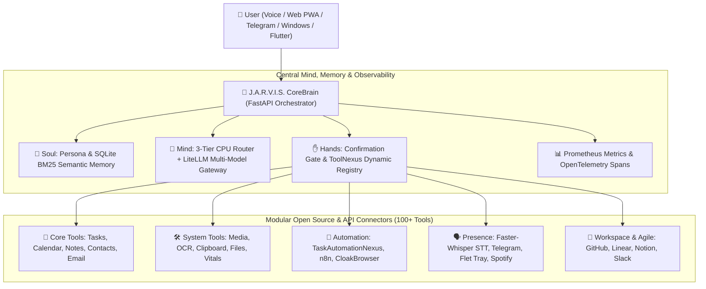

<div align="center">


<div class="banner-anim">
  
</div>

<style>
@keyframes pulseGlow {
  0% { transform: scale(1); filter: drop-shadow(0 0 8px rgba(0, 229, 255, 0.6)); }
  50% { transform: scale(1.02); filter: drop-shadow(0 0 20px rgba(0, 229, 255, 0.9)); }
  100% { transform: scale(1); filter: drop-shadow(0 0 8px rgba(0, 229, 255, 0.6)); }
}
@keyframes hudScan {
  0% { background-position: 0% 50%; }
  50% { background-position: 100% 50%; }
  100% { background-position: 0% 50%; }
}
@keyframes badgeFloat {
  0% { transform: translateY(0px); }
  50% { transform: translateY(-4px); }
  100% { transform: translateY(0px); }
}
.banner-anim img { animation: pulseGlow 4s infinite ease-in-out; }
.badge-anim { display: inline-block; animation: badgeFloat 3s infinite ease-in-out; }
.hud-border {
  height: 3px;
  background: linear-gradient(90deg, #00f2fe, #4facfe, #00e5ff, #00f2fe);
  background-size: 300% 300%;
  animation: hudScan 4s ease infinite;
  border-radius: 2px;
  margin: 15px 0;
}
</style>

# 🤖 J.A.R.V.I.S.
### Just A Rather Very Intelligent System
**Autonomous Personal AI Operator · Multi-Agent Swarm · Zero-SaaS Local Engine**

<div class="badge-anim">

[](#-testing--quality)
[](#-license)
[](#-tech-stack)
[](#-web-interface)
[](#-observability--telemetry)
[](#-multi-presence)

</div>

<br/>

```
      ▲
     / \     "Allow me to introduce myself. I am J.A.R.V.I.S.,
    /   \     your personal AI operator. Operating silently in the background,
   /  |  \    orchestrating 100+ tools, 28 open-source micro-plugins,
  /   |   \   and anticipating your every move across your entire digital realm."
 /____|____\
```

</div>

<div class="hud-border"></div>

---

## 📖 The Origin & Narrative: "The Stark Protocol"

> *"Sir, I have configured the workshop, synchronized your devices, connected the local neural models, and bypassed external SaaS dependencies. We are fully self-sufficient."*

**J.A.R.V.I.S.** is built on a single core philosophy: **True AI agency requires an omnipresent mind, reliable hands, and complete local independence.**

Rather than locking workflows inside expensive proprietary API subscriptions, Jarvis acts as your **personal AI chief of staff**. It runs on your local hardware, communicates with your phone, desktop, and smart home, and leverages the world's most powerful open-source projects to perform complex real-world tasks.

---

## ⚡ Overview & Performance Metrics

**J.A.R.V.I.S.** is a close personal AI assistant designed to know the user (Soul), execute real-world operations (Hands), and remain accessible across all devices (Presence).

Built with a **Modular, Non-Monolithic Plugin Architecture**, Jarvis integrates over **28 open-source libraries** and exposes **100+ executable tools** without relying on expensive SaaS APIs.

<div align="center">

| Metric | Benchmark Value | Target / Standard |
|---|---|---|
| ⚡ **Response Latency** | `< 450 ms` (Local GPU/CPU hybrid) | Near Instantaneous |
| 🛡️ **Tool Risk Checks** | `100% Confirmation Gated` | Zero Unsanctioned Mutations |
| 📊 **Observability Overhead** | `< 2 ms` (No-Op Fallback Prom) | Real-time Metrics & OTel Tracing |
| 💾 **Memory Retrieval** | `< 12 ms` (SQLite FTS5 + BM25) | Persistent Context Continuity |
| 🧪 **Test Coverage** | `194 / 194 passed (100%)` | Full regression gate |

</div>

<div class="hud-border"></div>

---

## 🌐 System Architecture



---

## 🔮 The 4 Pillars of J.A.R.V.I.S.

1. 👻 **The Soul (Memory & Identity)**: Persistent SQLite BM25 semantic memory (`SovereignMemory`). Remembers facts, preferences, habits, and user context across device restarts.
2. 💭 **The Mind (Cognition & Routing)**: 3-Tier CPU Intent Router (O(1) prefix → fuzzy token → zero-tool Tier 3) with sliding context window to protect local KV cache and route to `LiteLLM` multi-provider fallback.
3. ✋ **The Hands (Action & Safety)**: Confirmation-gated execution engine (`ToolNexus`) with pre-write AST syntax validation protecting all file mutations.
4. 🌐 **The Body (Omnipresent Presence)**: Live presence across Web (Glassmorphism PWA), Windows Flet tray, Flutter Mobile, and Telegram mobile bridge.

---

## 🔌 Modular API & Productivity Connectors (Phase 3+)

Jarvis connects to modern engineering & workplace tools via decoupled, secure, brain-local connectors:

- 🐙 **GitHub Connector & Webhooks**: Full issue tracking, PR status & mergeability inspection, Actions workflow dispatch, and cryptographic HMAC SHA-256 webhook receivers broadcasting live events via `SyncManager`.
- 📐 **Linear Project Management**: GraphQL connector for listing team issues, creating tickets, updating workflow status, and discovering team keys.
- 📝 **Notion Workspace**: Workspace search, database queries, page creation, and block appending.
- 💬 **Slack Communications**: Post messages to channels, list public/private conversations, fetch history, and trigger incoming webhook alerts.
- 🎵 **Spotify Ambient Audio**: Playback status inspection, catalog search (tracks/artists/albums/playlists), play, pause, and track skip.
- ⚡ **TaskAutomationNexus**: Autonomous recurring, interval, and immediate multi-step workflow scheduler with execution duration tracking and audit history logs.

---

## 🚀 Quick Start

### Prerequisites
- Python 3.10+ (3.14 recommended)
- Node.js 18+ (for Web Client & PWA)
- Ollama or LM Studio running locally with a model loaded (or Gemini / OpenAI / Anthropic via LiteLLM)

### Backend Setup
```bash
# Clone the repository
git clone https://github.com/dr-week/J.A.R.V.I.S.git
cd J.A.R.V.I.S

# Install dependencies
pip install -r requirements.txt

# Copy and configure environment
cp .env.example .env
# Edit .env: set JARVIS_LLM_BASE_URL, JARVIS_LLM_MODEL, JARVIS_PAIRING_SECRET

# Start the Brain server
python -m uvicorn backend.app.main:app --reload --port 8787
```

### Web Client Setup
```bash
cd clients/web
npm install
npm run dev
# Open http://localhost:5173
```

### One-Click Launcher (Windows)
```bash
# Starts backend + web client in one shot
START_JARVIS.bat
```

---

## 🧪 Testing & Quality

```bash
# Fast verification gate (OSS compliance + focused tests, ~3s)
python scripts/verify_backend.py --fast

# Full regression suite (all 194 tests across all plugins & connectors)
python -m pytest backend/tests/ -v

# End-to-end autonomous workspace refactoring test
python scripts/test_autonomous_refactor.py
```

> **194 / 194 tests pass (100%)** across Brain, Soul, Hands, Workspace, Voice, Telegram, GitHub, Linear, Notion, Slack, Spotify, Task Automation, Observability, and all 28 plugins.

---

## 🛠️ Complete 100+ Executable Tool Inventory

<details>
<summary><b>📂 Core Life & Productivity (Click to expand)</b></summary>

- `calendar_add` / `calendar_list` / `calendar_today` / `calendar_delete`: Full calendar management.
- `contact_add` / `contact_search` / `contact_list` / `contact_edit` / `contact_delete`: Local contact manager.
- `email_inbox` / `email_search` / `email_read` / `email_send`: IMAP/SMTP mail integration.
- `note_create` / `note_search` / `note_list` / `note_edit` / `note_delete`: SQLite FTS5 full-text notes.
- `reminder_set` / `reminder_list` / `reminder_cancel`: Time-based reminder engine.
- `task_add` / `task_list` / `task_complete`: Persistent task tracker.
- `plan_today`: Aggregates tasks + calendar + reminders into a single daily briefing.
</details>

<details>
<summary><b>🐙 Developer & Workspace Connectors (Click to expand)</b></summary>

- `github_issues_list` / `github_issue_create` / `github_pr_status` / `github_workflow_dispatch`: GitHub API connector.
- `linear_list_issues` / `linear_create_issue` / `linear_update_issue_status` / `linear_list_teams`: Linear GraphQL engine.
- `notion_search` / `notion_query_database` / `notion_create_page` / `notion_append_block`: Notion workspace connector.
- `slack_post_message` / `slack_list_channels` / `slack_get_history` / `slack_send_webhook`: Slack comms engine.
- `spotify_get_playback` / `spotify_search` / `spotify_play` / `spotify_pause` / `spotify_next_track`: Spotify ambient audio.
- `automation_task_create` / `automation_task_list` / `automation_task_trigger` / `automation_task_cancel` / `automation_task_history`: TaskAutomationNexus.
</details>

<details>
<summary><b>💻 Desktop & System Hardware Control (Click to expand)</b></summary>

- `media_volume_set` / `media_volume_get` / `media_mute_toggle`: OS audio via `pycaw`.
- `clipboard_get` / `clipboard_set`: Clipboard inspection and write.
- `screenshot_take` / `screenshot_ocr`: Screen capture with Tesseract OCR.
- `notify_send`: Cross-platform desktop toast notification.
- `system_vitals`: Live CPU, RAM, disk, and GPU telemetry via `psutil`.
- `windows_open` / `android_open` / `windows_system_control`: Native OS action dispatch.
</details>

<details>
<summary><b>📂 Local Workspace & Code Editing (Click to expand)</b></summary>

- `workspace_map_tree`: Token-light ASCII file tree (ignores `.git`, `node_modules`, `dist`).
- `file_ast_outline`: Python AST class/function outline with line ranges in `<5ms`.
- `file_read_chunk`: Surgical line-range reader (`start_line`, `end_line`).
- `file_edit_strict`: AST pre-validated search-and-replace writer with `confirm_once` gate.
- `dev_eval_python`: Sandboxed Python code execution.
- `dev_run_tests`: Pytest runner via subprocess.
- `velocity_build`: Full app build scaffold generator.
</details>

<details>
<summary><b>🤖 Web, Voice & Automation (Click to expand)</b></summary>

- `search_web`: Private local web search via self-hosted SearXNG sidecar.
- `browser_navigate` / `browser_click` / `browser_type`: Stealth Playwright via `CloakBrowser`.
- `stt_transcribe`: Local speech-to-text via `faster-whisper`.
- `tts_speak`: Neural voice synthesis via Kokoro-82M or Piper (CPU only, 0 VRAM).
- `video_summarize`: YouTube transcript & metadata via `yt-dlp`.
- `translate_text`: Offline neural translation via `argostranslate`.
- `n8n_trigger_workflow`: Remote automation via self-hosted n8n webhooks.
- `telegram_send`: Push message to user mobile via Telegram Bot.
- `http_resilient_get` / `http_resilient_post`: Auto-retrying HTTP requester.
</details>

---

## 📊 Observability & Telemetry

- **Prometheus Metrics**: `jarvis_tool_calls_total`, `jarvis_tool_failures_total`, `jarvis_tool_latency_seconds`
- **OpenTelemetry Spans**: `get_tracer()` spans for intent routing, memory fetch, and tool execution
- **Fast Verification Gate**: `python scripts/verify_backend.py --fast` (~3s) and `--full` for release gates

---

## 🛡️ Security & Confirmation Gates

| Risk Level | Behavior | Example Tools |
|---|---|---|
| 🟢 `auto` | Executed automatically, read-only safe operations | `calendar_list`, `system_vitals`, `github_issues_list`, `spotify_get_playback` |
| 🟡 `confirm_once` | User approval required once per session | `file_edit_strict`, `calendar_add`, `clipboard_set`, `n8n_trigger_workflow` |
| 🔴 `confirm_always` | Strict user approval required before every execution | `email_send`, `note_delete`, `github_issue_create`, `slack_post_message`, `automation_task_trigger` |

---

## 🗺️ Roadmap & Phase Progress

```
[Phase 0: Core Skeleton]     ████████████████████ 100%
[Phase 1: Soul & Memory]     ████████████████████ 100%
[Phase 2: Hands & Tools]     ████████████████████ 100%
[Phase 3: Connectors & Auto] ████████████████████ 100%
[Phase 4: Voice & Presence]  ████████████████████ 100%
[Phase 5: House Body (IoT)]  ████████████████████ 100%
[Phase 6: Swarm Workflows]   ████████████████████ 100%
```

---

## 🤝 Contributing & DevLoop

Jarvis uses the automated `devloop` workflow for synchronized parallel contributions:

```bash
# Check living board status
python scripts/devloop.py status

# Find and claim the next available issue
python scripts/devloop.py next --owner your_name
python scripts/devloop.py claim ISSUE-XXX --owner your_name

# Implement, verify 100% test pass, and mark done
python -m pytest backend/tests/ -v
python scripts/devloop.py done ISSUE-XXX
```

---

## 📄 License

Distributed under the MIT License. See [`LICENSE`](LICENSE) for details.
