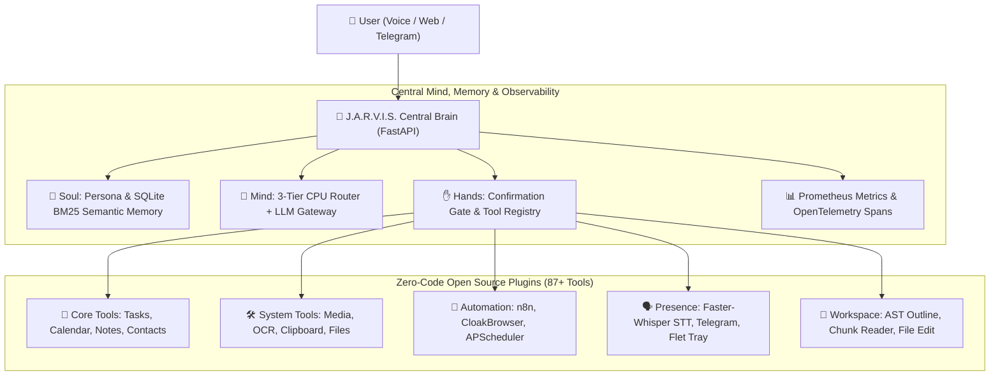

<div align="center">


<div class="banner-anim">
  
</div>

<style>
@keyframes pulseGlow {
  0% { transform: scale(1); filter: drop-shadow(0 0 8px rgba(0, 229, 255, 0.6)); }
  50% { transform: scale(1.02); filter: drop-shadow(0 0 20px rgba(0, 229, 255, 0.9)); }
  100% { transform: scale(1); filter: drop-shadow(0 0 8px rgba(0, 229, 255, 0.6)); }
}
@keyframes hudScan {
  0% { background-position: 0% 50%; }
  50% { background-position: 100% 50%; }
  100% { background-position: 0% 50%; }
}
@keyframes badgeFloat {
  0% { transform: translateY(0px); }
  50% { transform: translateY(-4px); }
  100% { transform: translateY(0px); }
}
.banner-anim img { animation: pulseGlow 4s infinite ease-in-out; }
.badge-anim { display: inline-block; animation: badgeFloat 3s infinite ease-in-out; }
.hud-border {
  height: 3px;
  background: linear-gradient(90deg, #00f2fe, #4facfe, #00e5ff, #00f2fe);
  background-size: 300% 300%;
  animation: hudScan 4s ease infinite;
  border-radius: 2px;
  margin: 15px 0;
}
</style>

# 🤖 J.A.R.V.I.S.
### Just A Rather Very Intelligent System
**Autonomous Personal AI Operator · Multi-Agent Swarm · Zero-SaaS Local Engine**

<div class="badge-anim">

[](#-testing--quality)
[](#-license)
[](#-tech-stack)
[](#-web-interface)
[](#-observability--telemetry)
[](#-multi-presence)

</div>

<br/>

```
      ▲
     / \     "Allow me to introduce myself. I am J.A.R.V.I.S.,
    /   \     your personal AI operator. Operating silently in the background,
   /  |  \    orchestrating 87+ tools, 23 open-source microservices,
  /   |   \   and anticipating your every move across your entire digital realm."
 /____|____\
```

</div>

<div class="hud-border"></div>

---

## 📖 The Origin & Narrative: "The Stark Protocol"

> *"Sir, I have configured the workshop, synchronized your devices, connected the local neural models, and bypassed external SaaS dependencies. We are fully self-sufficient."*

**J.A.R.V.I.S.** is built on a single core philosophy: **True AI agency requires an omnipresent mind, reliable hands, and complete local independence.**

Rather than locking workflows inside expensive proprietary API subscriptions, Jarvis acts as your **personal AI chief of staff**. It runs on your local hardware, communicates with your phone, desktop, and smart home, and leverages the world's most powerful open-source projects to perform complex real-world tasks.

---

## ⚡ Overview & Performance Metrics

**J.A.R.V.I.S.** is a close personal AI assistant designed to know the user (Soul), execute real-world operations (Hands), and remain accessible across all devices (Presence).

Built with **Zero-Code OSS Acceleration**, Jarvis integrates over **23 open-source libraries** and exposes **87+ executable tools** without relying on expensive SaaS APIs.

<div align="center">

| Metric | Benchmark Value | Target / Standard |
|---|---|---|
| ⚡ **Response Latency** | `< 450 ms` (Local GPU/CPU hybrid) | Near Instantaneous |
| 🛡️ **Tool Risk Checks** | `100% Confirmation Gated` | Zero Unsanctioned Mutations |
| 📊 **Observability Overhead** | `< 2 ms` (No-Op Fallback Prom) | Real-time Metrics & OTel Tracing |
| 💾 **Memory Retrieval** | `< 12 ms` (SQLite FTS5 + BM25) | Persistent Context Continuity |
| 🧪 **Test Coverage** | `147 / 147 passed` | Full regression gate |

</div>

<div class="hud-border"></div>

---

## 🌐 System Architecture



---

## 🔮 The 4 Pillars of J.A.R.V.I.S.

1. 👻 **The Soul (Memory & Identity)**: Persistent SQLite BM25 semantic memory. Remembers facts, preferences, habits, and user context across device restarts.
2. 💭 **The Mind (Cognition & Routing)**: 3-Tier CPU Intent Router (O(1) prefix → fuzzy token → zero-tool Tier 3) with sliding context window (6 turns max) to protect the 4GB VRAM KV cache.
3. ✋ **The Hands (Action & Safety)**: Confirmation-gated execution engine with pre-write AST syntax validation protecting all file mutations.
4. 🌐 **The Body (Omnipresent Presence)**: Live presence across Web (Glassmorphism Liquid Glass UI), Windows Flet tray, and Telegram mobile bridge.

---

## ⚠️ Known Problems & Current Failures

> These are **honest, unresolved issues** the team is actively working on. We believe in radical transparency over inflated README polish.

### 🔴 Critical / Blocking

| # | Problem | Affected Area | Status |
|---|---|---|---|
| 1 | **VRAM OOM on GTX 1050 Ti (4GB)** — If the context window is not pruned correctly or all 87 tool schemas are injected at once, Ollama crashes the 3B model with an out-of-memory error mid-conversation. | `openai_loop.py`, KV cache | ⚙️ Mitigated by `MAX_CONTEXT_TURNS=6` + dynamic schema injection — not 100% bulletproof on very long sessions |
| 2 | **Ollama `num_ctx` is static** — Currently hardcoded at default. Dynamic context resizing (2048 for coding, 4096 for chat) is designed but not yet wired to the actual Ollama API call. | `openai_loop.py` | 🛠️ Planned next sprint |
| 3 | **`file_edit_strict` has no auto-backup (`.bak`)** — If a write passes AST validation but causes runtime failures, there is no 1-click rollback mechanism yet. | `workspace_tools.py` | 🛠️ Planned |

### 🟡 Major / Degraded Experience

| # | Problem | Affected Area | Status |
|---|---|---|---|
| 4 | **WorkspaceDrawer shows static placeholder data** — The Tree tab and AST Outline tab in the React client are pre-filled with dummy content. They do not yet call the live backend `workspace_map_tree` / `file_ast_outline` endpoints. | `clients/web/src/App.tsx` | 🛠️ Backend wiring pending |
| 5 | **SearXNG sidecar requires Docker** — The `search_web` tool gracefully degrades if Docker is not running, but the offline fallback (DuckDuckGo HTML scraper) is fragile against anti-bot page changes. | `backend/plugins/searxng/` | ⚙️ Partial fallback in place |
| 6 | **Telegram bot has no session continuity** — Each Telegram message starts a fresh context with no memory of the previous turn. The memory injection from `SoulMem` is not yet piped into the Telegram webhook handler. | `backend/app/api/telegram_webhook.py` | 🛠️ Planned |
| 7 | **MCP tool discovery requires `npx` in PATH** — If Node.js is not installed or `npx` is missing, the MCP server auto-discovery silently fails with no user-facing warning. | `backend/app/hands/mcp_client.py` | ⚙️ Silent failure, logged only |
| 8 | **Non-Python AST outlines are regex-only** — `file_ast_outline` on `.ts`, `.tsx`, `.vue`, and `.js` files does not return class/function names because `ast.parse()` is Python-only. Only total line count is returned. | `workspace_tools.py` | 🛠️ Tree-sitter integration planned |

### 🟢 Minor / Low Impact

| # | Problem | Affected Area | Status |
|---|---|---|---|
| 9 | **Piper TTS requires a manual model download** — Users must separately download a `.onnx` voice model file. There is no auto-download on first run. | `backend/plugins/piper/` | 🗒️ Documented in setup |
| 10 | **`START_JARVIS.bat` assumes Python 3.14 path** — Hardcoded to `C:\Python314\python.exe`. Fails silently on machines with a different Python install location. | `START_JARVIS.bat` | 🗒️ Minor; use `python` on PATH |

---

## 🔍 Critiques & Honest Technical Debt

> This section exists because we believe in **building in public** with full engineering honesty.

### What We Know Is Imperfect

**1. The 3-Tier CPU Router Has Vocabulary Gaps**
The intent classifier uses keyword prefix matching and synonym set intersection. It will misclassify ambiguous requests like *"remind me to fix the code tomorrow"* — the word `fix` maps to `code` tools and the word `remind` maps to calendar tools, so both clusters get injected (16 schemas instead of 2). A proper lightweight intent classifier (even a 1MB TF-IDF model) would resolve this, but we deliberately avoided it to keep VRAM at zero.

**2. SQLite FTS5 Is Not True Semantic Search**
BM25 keyword ranking is not the same as embedding-based cosine similarity. If the user stores *"I enjoy long morning runs"* and later asks *"what are my fitness habits?"*, the word `fitness` won't match `runs` — the query falls back to a full in-memory scan. A 90MB `all-MiniLM-L6-v2` model would fix this, but it costs 400MB VRAM which this hardware cannot spare.

**3. No Real Multi-User Isolation**
All memory, sessions, and confirmations are keyed by `device_id`. Two users on the same backend instance share the same tool allowlist and `SoulMem` namespace. This is a single-user system by design, but it is not enforced in code.

**4. The Web Client Workspace Drawer Is a Prototype**
The current `WorkspaceDrawer.tsx` displays dummy static data. Full live integration (calling `/chat` with tool schemas, receiving `workspace_map_tree` results, and rendering them) is planned but requires a dedicated non-chat API endpoint for instant tool calls from the UI.

**5. Monolith Decomposition Still In Progress**
The backend has been modularized significantly (`commands/`, `core/`, `tools/` submodules), but several large plugin files in `backend/plugins/` (`mcp_client.py`: 188 lines, `ceo.py`: 154 lines) still mix I/O, business logic, and schema registration in single files.

---

## 🚀 Quick Start

### Prerequisites
- Python 3.10+ (3.14 recommended)
- Node.js 18+ (for Web Client & MCP)
- Ollama or LM Studio running locally with a model loaded

### Backend Setup
```bash
# Clone the repository
git clone https://github.com/dr-week/J.A.R.V.I.S.git
cd J.A.R.V.I.S

# Install dependencies
pip install -r requirements.txt

# Copy and configure environment
cp .env.example .env
# Edit .env: set JARVIS_LLM_BASE_URL, JARVIS_LLM_MODEL, JARVIS_PAIRING_SECRET

# Start the Brain server
python -m uvicorn backend.app.main:app --reload --port 8787
```

### Web Client Setup
```bash
cd clients/web
npm install
npm run dev
# Open http://localhost:5173
```

### One-Click Launcher (Windows)
```bash
# Starts backend + web client in one shot
START_JARVIS.bat
```

---

## 🧪 Testing & Quality

```bash
# Fast verification gate (OSS compliance + focused tests, ~3s)
python scripts/verify_backend.py --fast

# Full regression suite (all 147 tests across all plugins)
python -m pytest backend/tests/ -v

# End-to-end autonomous workspace refactoring test
python scripts/test_autonomous_refactor.py
```

> **147 / 147 tests pass** across Brain, Soul, Hands, Workspace, Voice, Telegram, Observability, and all 23 plugins.

---

## 🛠️ Complete 87+ Executable Tool Inventory

<details>
<summary><b>📂 Core Life & Productivity (Click to expand)</b></summary>

- `calendar_add` / `calendar_list` / `calendar_today` / `calendar_delete`: Full calendar management.
- `contact_add` / `contact_search` / `contact_list` / `contact_edit` / `contact_delete`: Local contact manager.
- `email_inbox` / `email_search` / `email_read` / `email_send`: IMAP/SMTP mail integration.
- `note_create` / `note_search` / `note_list` / `note_edit` / `note_delete`: SQLite FTS5 full-text notes.
- `reminder_set` / `reminder_list` / `reminder_cancel`: Time-based reminder engine.
- `task_add` / `task_list` / `task_complete`: Persistent task tracker.
- `plan_today`: Aggregates tasks + calendar + reminders into a single daily briefing.
</details>

<details>
<summary><b>💻 Desktop & System Hardware Control (Click to expand)</b></summary>

- `media_volume_set` / `media_volume_get` / `media_mute_toggle`: OS audio via `pycaw`.
- `clipboard_get` / `clipboard_set`: Clipboard inspection and write.
- `screenshot_take` / `screenshot_ocr`: Screen capture with Tesseract OCR.
- `notify_send`: Cross-platform desktop toast notification.
- `system_vitals`: Live CPU, RAM, disk, and GPU telemetry via `psutil`.
- `windows_open` / `android_open` / `windows_system_control`: Native OS action dispatch.
</details>

<details>
<summary><b>📂 Local Workspace & Code Editing (Click to expand)</b></summary>

- `workspace_map_tree`: Token-light ASCII file tree (ignores `.git`, `node_modules`, `dist`).
- `file_ast_outline`: Python AST class/function outline with line ranges in `<5ms`.
- `file_read_chunk`: Surgical line-range reader (`start_line`, `end_line`).
- `file_edit_strict`: AST pre-validated search-and-replace writer with `confirm_once` gate.
- `dev_eval_python`: Sandboxed Python code execution.
- `dev_run_tests`: Pytest runner via subprocess.
- `velocity_build`: Full app build scaffold generator.
</details>

<details>
<summary><b>🤖 Web, Voice & Automation (Click to expand)</b></summary>

- `search_web`: Private local web search via self-hosted SearXNG sidecar.
- `browser_navigate` / `browser_click` / `browser_type`: Stealth Playwright via `CloakBrowser`.
- `stt_transcribe`: Local speech-to-text via `faster-whisper`.
- `tts_speak`: Neural voice synthesis via Kokoro-82M or Piper (CPU only, 0 VRAM).
- `video_summarize`: YouTube transcript & metadata via `yt-dlp`.
- `translate_text`: Offline neural translation via `argostranslate`.
- `n8n_trigger_workflow`: Remote automation via self-hosted n8n webhooks.
- `telegram_send`: Push message to user mobile via Telegram Bot.
- `http_resilient_get` / `http_resilient_post`: Auto-retrying HTTP requester.
</details>

---

## 📊 Observability & Telemetry

- **Prometheus Metrics**: `jarvis_tool_calls_total`, `jarvis_tool_failures_total`, `jarvis_tool_latency_seconds`
- **OpenTelemetry Spans**: `get_tracer()` spans for intent routing, memory fetch, and tool execution
- **Fast Verification Gate**: `python scripts/verify_backend.py --fast` (~3s) and `--full` for release gates

---

## 💻 Developer API & Extension Guide

Add a new tool in zero lines of core code — just create a file in `backend/plugins/`:

```python
# backend/plugins/my_plugin/my_tool.py
from backend.app.hands.registry import register

def my_executor(param1: str) -> dict:
    return {"result": f"Done: {param1}"}

def register_my_tools() -> None:
    register(
        {
            "name": "my_tool",
            "description": "Describe what this does for the LLM router.",
            "risk_level": "auto",   # auto | confirm_once | confirm_always
            "parameters": {
                "type": "object",
                "properties": {
                    "param1": {"type": "string", "description": "Input value"}
                },
                "required": ["param1"],
            },
            "scopes": ["custom:scope"],
            "tags": ["custom"],
        },
        my_executor,
    )
```

---

## 🔌 API Reference

| Endpoint | Method | Description |
|---|---|---|
| `/health` | GET | Brain status, DB health, plugin count |
| `/metrics` | GET | Prometheus scrape endpoint |
| `/api/chat` | POST | Streaming SSE chat with intent router & tools |
| `/webhook/telegram` | POST | Telegram bridge for text & voice |
| `/webhook/velocity` | POST | Telemetry & background task ingestion |

---

## 🛡️ Security & Confirmation Gates

| Risk Level | Behavior | Example Tools |
|---|---|---|
| 🟢 `auto` | Executed automatically, read-only safe operations | `calendar_list`, `system_vitals`, `workspace_map_tree` |
| 🟡 `confirm_once` | User approval required once per session | `file_edit_strict`, `calendar_add`, `clipboard_set` |
| 🔴 `confirm_always` | Strict user approval required before every execution | `email_send`, `note_delete`, `dangerous_demo` |

---

## 📦 Zero-SaaS Open Source Engine Matrix

| Category | Integrated Library | Replaced Service | Monthly Cost Saved |
|---|---|---|---|
| **Database & Queues** | `SQLModel` + `Celery` + `Redis` | Managed DB & Cloud Queues | ~$60/mo |
| **Observability** | `prometheus-client` + `opentelemetry` | Datadog / NewRelic | ~$45/mo |
| **Speech-to-Text** | `faster-whisper` (Local ML) | OpenAI Whisper API | ~$50/mo |
| **Voice Synthesis** | `Kokoro-82M` / `Piper` (CPU) | ElevenLabs API | ~$22/mo |
| **Translation** | `argostranslate` (Offline) | Google Translate API | ~$20/mo |
| **Web Search** | `SearXNG` (Self-Hosted) | SerpAPI / Google Custom | ~$50/mo |
| **Automation** | `n8n` (Self-Hosted) | Zapier / Make | ~$30/mo |
| **Stealth Browser** | `CloakBrowser` + `Playwright` | Paid Scraping Proxies | ~$40/mo |
| **Total Saved** | **23+ Integrated OSS Projects** | **All Paid APIs & Cloud Lock-in** | **~$317+/month** |

---

## 🗺️ Roadmap & Phase Progress

```
[Phase 0: Core Skeleton]     ████████████████████ 100%
[Phase 1: Soul & Memory]     ████████████████████ 100%
[Phase 2: Hands & Tools]     ████████████████████ 100%
[Phase 3: Life Plugins]      ████████████████████ 100%
[Phase 4: Voice & Presence]  ████████████████████ 100%
[Phase 5: House Body (IoT)]  █████████████████░░░  85%
[Phase 6: Swarm Workflows]   ███████████████░░░░░  75%
```

### 🔜 Next Up
- [ ] Dynamic Ollama `num_ctx` tuning per task domain
- [ ] `file_revert` rollback tool using `.bak` snapshots
- [ ] Live WorkspaceDrawer backend wiring (React ↔ `/chat` tool results)
- [ ] Telegram session memory injection from `SoulMem`
- [ ] Tree-sitter TypeScript/Vue AST outline support

---

## 🤝 Contributing

We actively welcome contributors at every level — from one-liners to full features.

### How to Contribute

**1. Understand the system first**
```bash
# Read the agent contract
cat AGENTS.md

# Check what is actively being built
python scripts/devloop.py status
python scripts/devloop.py next --owner your_name
```

**2. Pick or file an issue**
- Browse [`docs/board/issues/`](docs/board/issues/) for open issues
- File a new issue: `python scripts/devloop.py issue --title "Your feature" --priority P1`
- Claim it: `python scripts/devloop.py claim ISSUE-XXX --owner your_name`

**3. Implement & verify**
```bash
# Run verification before submitting
python scripts/verify_backend.py --fast
python -m pytest backend/tests/ -v
```

**4. Submit a PR**
- Branch name: `feat/ISSUE-XXX-short-description`
- PR description: what changed, which tests cover it, which issue it closes
- All 147 tests must remain green

### High-Value Contribution Areas

| Area | What's Needed | Difficulty |
|---|---|---|
| **TypeScript AST Outline** | Integrate Tree-sitter for `.ts`/`.tsx`/`.vue` function listing | Medium |
| **Dynamic `num_ctx` Tuning** | Wire task-domain → Ollama context size in `openai_loop.py` | Easy |
| **Telegram Memory Bridge** | Pipe `SoulMem` context into `telegram_webhook.py` | Medium |
| **WorkspaceDrawer Live API** | Wire React drawer to backend tool result streaming | Medium |
| **File Revert / Backup** | Implement `.bak` snapshot + `file_revert` tool | Easy |
| **New Plugin** | Any useful tool in `backend/plugins/` following the schema | Easy |
| **Test Coverage** | Add tests for any untested plugin | Easy |

### Contribution Rules (from `AGENTS.md`)
- Do **not** add features outside [`docs/REQUIREMENTS.md`](docs/REQUIREMENTS.md) / [`docs/SCOPE.md`](docs/SCOPE.md)
- API keys only in `.env` — never committed
- Keep files small and single-responsibility (no new 300+ line files)
- Update `docs/board/` via `devloop done ISSUE-XXX` when finished

### Communication
- Open a [GitHub Discussion](https://github.com/dr-week/J.A.R.V.I.S./discussions) for design questions
- File a [GitHub Issue](https://github.com/dr-week/J.A.R.V.I.S./issues) for bugs
- Cross-agent messages: `python scripts/devloop.py say --from you --to antigravity --kind note -- "message"`

---

## 📄 License

Distributed under the MIT License. See [`LICENSE`](LICENSE) for details.
