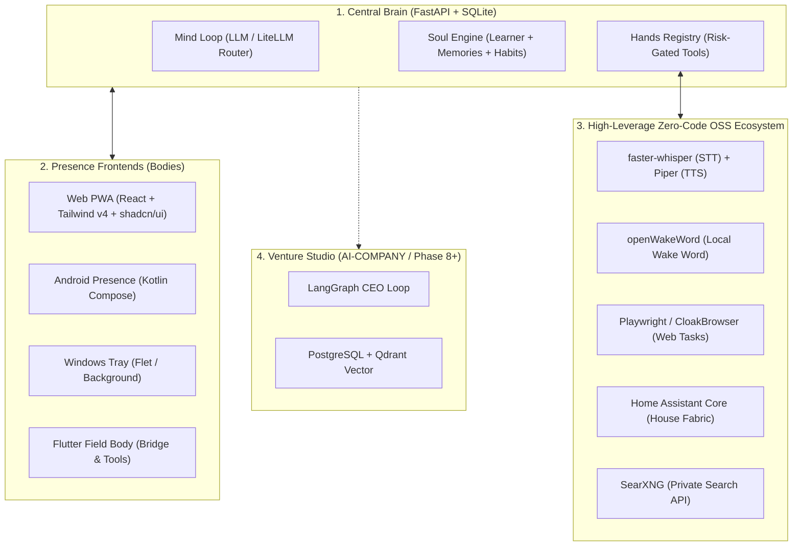

# Jarvis Master Plan & Architectural Blueprint

This document is the **canonical master execution plan** for the entire Jarvis project. It tracks priorities, dependencies, technical architecture, and open-source integrations to maintain persistent project memory across coding sessions.

---

## 1. Core Architecture: The 4-Layer System

---

## 2. Phased Roadmap & Priority Matrix

| Phase | Title | Objective | Status | Proof / Exit Criteria |
|---|---|---|---|---|
| **D0-D1** | Docs & Devloop OS | Developer contracts, issue board, automation scripts | ✅ Done | `devloop sync` & `verify_doc_links.py` |
| **Phase 0** | Skeleton | Monorepo boots, FastAPI brain talks to clients | ✅ Done | `/health` endpoint + WebSocket sync |
| **Phase 1** | Soul | Identity, memory recall, habit learning | ✅ Done | `learner.py` + proactive prompt injection |
| **Phase 2** | Hands | Multi-step tool execution, risk gates, device bridges | ✅ Done | `proof_phase2_windows.py` + action audit |
| **Phase 3** | Life Tools | Calendar, reminders, email, notes, weather plugins | ✅ Done | `test_phase3_life_tools.py` |
| **Phase 4** | Voice & Presence | Hands-free STT/TTS loop, tray service, push status | 🟡 Active | Windows tray voice turn + Web UX sync |
| **Phase 5** | House Body | Home Assistant room continuity, voice scenes | 🔜 Next | Cross-room presence + scene triggers |
| **Phase 6** | Expand Forever | Hot-reload plugin SDK & versioned tool schema | Planned | 3rd-party plugin template verification |
| **Phase 7** | Stark Endgame | Predictive actuation, AR interface, local fine-tuning | Planned | Autonomous proactive task execution |
| **Phase 8** | Enterprise Protocol | Autonomous business operator (`AI-COMPANY/`) | Planned | Stripe integration + automated revenue |
| **Phases 9-11**| Forge / EDITH / BCI | Parametric CAD, swarm mesh, neural link | Planned | 3D print stream + BCI EEG integration |

---

## 3. High-Leverage GitHub Repositories & Reusable Modules

| Domain | Canonical GitHub Repo | Pattern | Effort & Code Saved | What It Replaces |
|---|---|---|---|---|
| **Model Gateway** | [`BerriAI/litellm`](https://github.com/BerriAI/litellm) | PyPI Wrapper | ~2000 lines (2 weeks) | Custom failover & token limit logic |
| **Local STT** | [`SYSTRAN/faster-whisper`](https://github.com/SYSTRAN/faster-whisper) | PyPI Wrapper | ~3500 lines (1 month) | Cloud STT costs + custom C++ whisper bindings |
| **Local TTS** | [`rhasspy/piper`](https://github.com/rhasspy/piper) | CLI Subprocess | ~1500 lines (2 weeks) | ElevenLabs cloud API latency & costs |
| **Wake Word** | [`dscripka/openWakeWord`](https://github.com/dscripka/openWakeWord) | PyPI Wrapper | ~2500 lines (3 weeks) | Custom neural network model training |
| **Browser Tasks**| [`microsoft/playwright-python`](https://github.com/microsoft/playwright-python) | PyPI Wrapper | ~4000 lines (1 month) | Fragile OS GUI automation (`pywinauto`) |
| **House Fabric** | [`home-assistant/core`](https://github.com/home-assistant/core) | REST Sidecar | ~100k+ lines (Years) | Custom IoT protocol drivers (Zigbee/Matter/Z-Wave) |
| **Web Search** | [`searxng/searxng`](https://github.com/searxng/searxng) | Docker Sidecar | ~2000 lines (2 weeks) | Paid Google/Bing API wrappers + scrapers |
| **UI Primitives**| [`shadcn/ui`](https://github.com/shadcn-ui/ui) + [`lucide-react`](https://github.com/lucide-react/lucide) | Headless Radix | 90% of custom CSS | Bespoke CSS classes and ARIA accessibility code |

---

## 4. UI Motion & Control Specification

All presence surfaces adhere to the standardized presets in [`docs/dev/ANIMATIONS.md`](dev/ANIMATIONS.md):
- **`.neural-active`**: 2s pulse glow indicating active thought/listening.
- **`.animate-entrance`**: 0.35s fluid slide-fade entry for message streams.
- **`.card-interactive`**: Micro-elevation (3D lift & soft shadow) on hover.
- **`.skeleton-shimmer`**: Shimmer wave placeholder for async loading cards.
- **`.aurora-active`**: Indigo/purple glowing halo for focus drawers & confirmations.
- **`.ambient-mesh-bg`**: Subtle non-flat background gradient shift.

---

## 5. Verification & Chain Reaction Protocol

System integrity must be validated via [`scripts/chain_reaction_test.py`](../scripts/chain_reaction_test.py) after major changes:
1. **Doc Link Audit**: Zero broken relative markdown links across 54+ files.
2. **Devloop Board Sync**: Auto-sync `docs/board/LIVE_PLAN.md`.
3. **Web Bundle Build**: Clean Vite production compilation with 0 TS errors.
4. **AI Training Export**: Extraction of interaction logs to `training_dataset.jsonl`.
