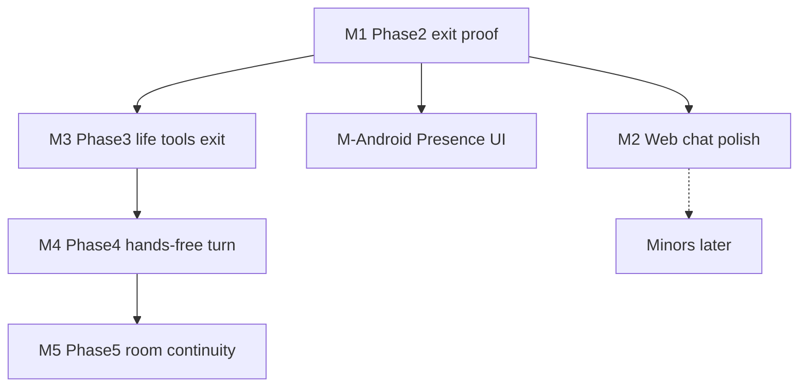

# Major work plan — post-swarm reset

**Why this exists:** Board shows **0 open** / ~98 done, but ROADMAP exits and product UI are **not** finished. Treat issue “done” as noisy; this plan is the source of truth until new issues are claimed.

**Lanes:** `cursor` = backend / Windows / **Kotlin Android** / HA · `antigravity` = web / Flutter · `ministral` = mini docs only  
**Related:** [ROADMAP.md](../ROADMAP.md) · [PRESENCE_STACKS.md](PRESENCE_STACKS.md) · [STRATEGY_FORWARD.md](STRATEGY_FORWARD.md)

---

## Major tracks (do these)

| ID | Major task | Owner | Outcome | Est. |
|----|------------|-------|---------|------|
| **M1** | **Phase 2 exit proof** — multi-step Windows action + audit | `cursor` | **Done** — `scripts/proof_phase2_windows.py` + ROADMAP note (ISSUE-147) | done |
| **M-Android** | **Kotlin Presence UI** — pair, bridge status, confirm, open web | `cursor` | Phone body usable beside Flutter Field; not a second chat app | 0.5–1 d |
| **M2** | **Web chat product polish** — confirm UX, `velocity_update` banner, DESIGN anti-dupes | `antigravity` | Chat MVP feels finished (~90% UI) | 1–2 d |
| **M3** | **Phase 3 exit** — ≥3 domain plugins pass REQUIREMENTS samples | `cursor` | **Done** — `test_phase3_life_tools.py` (ISSUE-149) | done |
| **M4** | **Phase 4 exit** — one hands-free voice turn (Windows) + sync status | `cursor` | “Always there” demo | 1–2 d |
| **M5** | **Phase 5 continuity** — start scene/habit in “room” session → continue on web | split | House body demo | 2 d |

**M-Android status:** shipped in **[ISSUE-150](../board/issues/ISSUE-150.md)** (`clients/android` Presence UI + tokenized bridge).

---

## Explicitly later (minors / do not swarm)

- Money-maker / CEO / CAD / ROS2 / BCI  
- Devloop 117–118 split (unless blocking)  
- PWA tweaks, Flutter leftover chat file cleanup  
- Ministral doc-only mop-up  

---

## Week plan

| Week | Focus | Parallel |
|------|--------|----------|
| **1** | **M1** exit proof + **M-Android** Presence + **M2** web polish | cursor ∥ antigravity |
| **2** | **M3** life tools acceptance pack | cursor; antigravity helps web glue |
| **3** | **M4** voice turn | cursor |
| **4** | **M5** house continuity | both |

---

## Definition of “major done”

- Issue with **Lane** + acceptance  
- `devloop verify` + one automated or scripted proof  
- Demo script line in [DEMO.md](../DEMO.md) if user-visible  

---

## Immediate next claim

1. **M-Android** — **[ISSUE-150](../board/issues/ISSUE-150.md)** done (Presence UI)  
2. Claim **M1** (Phase 2 exit proof) — `cursor` → **[ISSUE-147](../board/issues/ISSUE-147.md)**  
3. Claim **M2** — `antigravity` → **[ISSUE-148](../board/issues/ISSUE-148.md)**  
4. Do not open Phase 7–11 issues yet  

Also: **[ISSUE-149](../board/issues/ISSUE-149.md)** (M3). M4/M5 open when week 3–4 starts.
