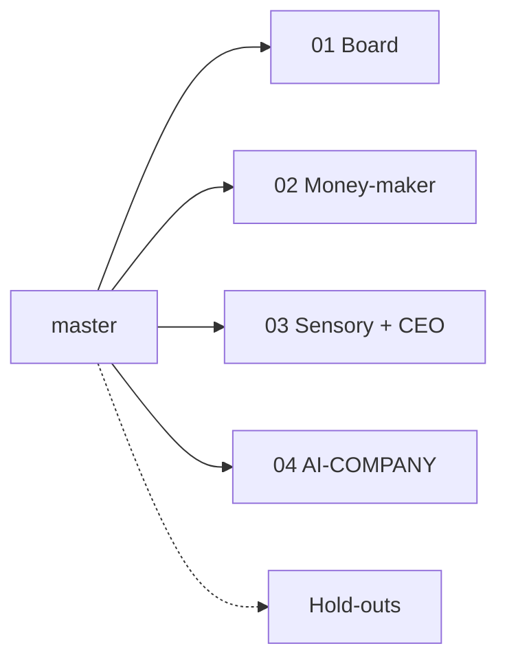

# PR split plan — uncommitted work on `master`

Split dirty-tree work into **small independent PRs**. No branches until you approve a slice and a remote exists.

**Lanes:** [PARALLEL.md](PARALLEL.md) (no `CODEOWNERS`).  
**Related:** [MODULARITY_PLAN.md](MODULARITY_PLAN.md) · [AI_CODER_AUTOMATION.md](AI_CODER_AUTOMATION.md) · [../DEMO.md](../DEMO.md)

## Slices

| # | Doc | PR title |
|---|-----|----------|
| 1 | [pr-slices/01-board-sync.md](pr-slices/01-board-sync.md) | Board sync + ISSUE notes |
| 2 | [pr-slices/02-money-maker.md](pr-slices/02-money-maker.md) | Money-maker plugin + skills |
| 3 | [pr-slices/03-sensory-ceo.md](pr-slices/03-sensory-ceo.md) | Brain sensory + company CEO |
| 4 | [pr-slices/04-ai-company-docs.md](pr-slices/04-ai-company-docs.md) | AI-COMPANY strategy docs |

Index: [pr-slices/README.md](pr-slices/README.md)

**Ministral:** slices **01** and **04** (single-file doc edits only) — [MINISTRAL.md](MINISTRAL.md). Not **02** / **03**.

## Hold out (not in 01–04)

| Path | Why |
|------|-----|
| `scripts/core/board_io.py` (`MAX_PARALLEL` 2→10) | Policy; own tiny PR |
| `pyproject.toml` + `uv.lock` (`fastmcp`) | Optional attach to **02** only if needed |
| `.refact/buddy/**` | Local runtime noise |
| `plugins/velocity_builder` dirty gitlink | Nested repo; no `.gitmodules` |

## Blocker

No git remote `origin` — add a remote before push / `gh pr create`.

## Stacking

None. All four land independently from `master`.
