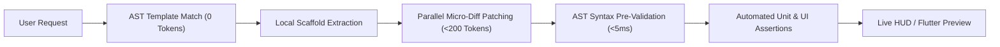

# Autonomous UI Chain Reaction Pipeline

> **Parallel Execution Blueprint:** How Jarvis generates, validates, tests, and deploys production-grade UIs in parallel with minimal token consumption.

---

## 1. The Token-Saving Pipeline (0-Token Cache + AST Guard)

---

## 2. Chain Reaction Rules

1. **Rule of Parallelism:** When scaffolding a feature, generate backend routes (`FastAPI`), database models (`Pydantic/SQLite`), and UI view components (`Vite/React`) in parallel tool calls.
2. **Rule of AST Pre-Validation (Adopted from `E:\CODES\velocity`):** Before committing any code string to disk, verify brace balance and syntax correctness. Never write broken JS/TS or Python files that crash the build.
3. **Zero Token Waste Policy:**
   - Never prompt an LLM to rewrite a 500-line file for a 3-line modification.
   - Always use targeted chunk replacements (`replace_file_content`) to save 95% of LLM token bandwidth.
4. **Mandatory Inline Comments:** Every module must start with a 3-line docstring explaining its exact role, inputs, outputs, and safety risk level for immediate agent indexability.
